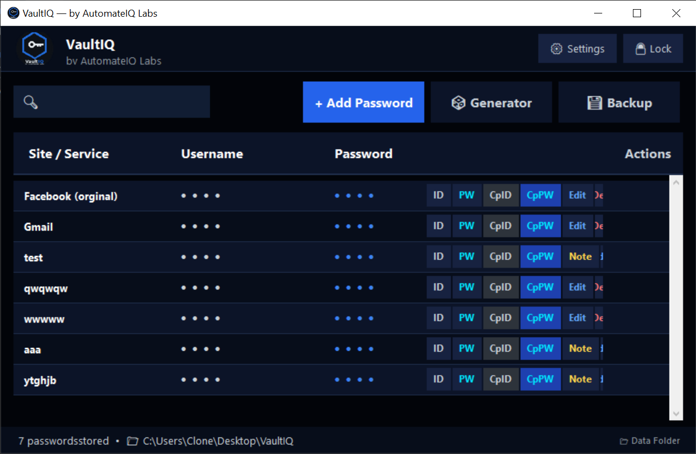
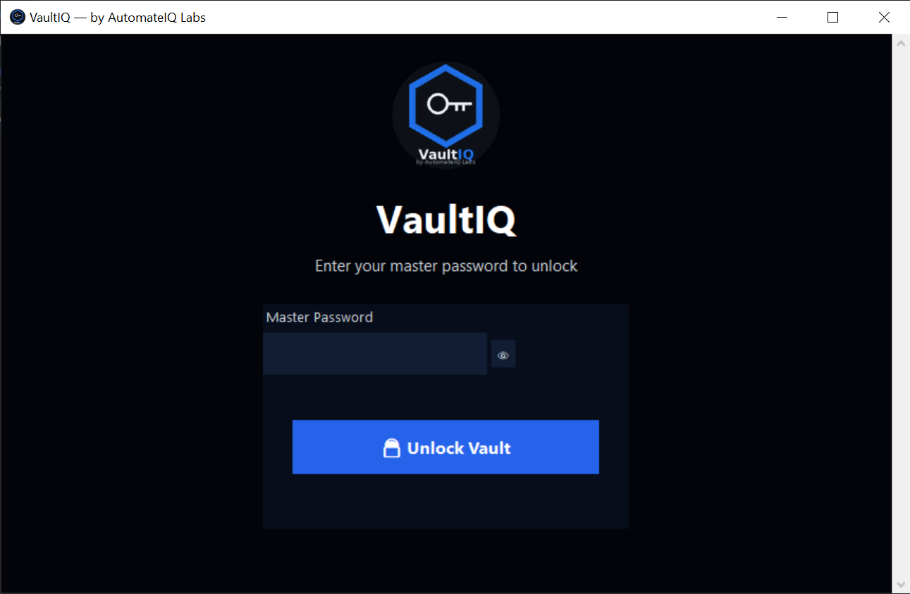
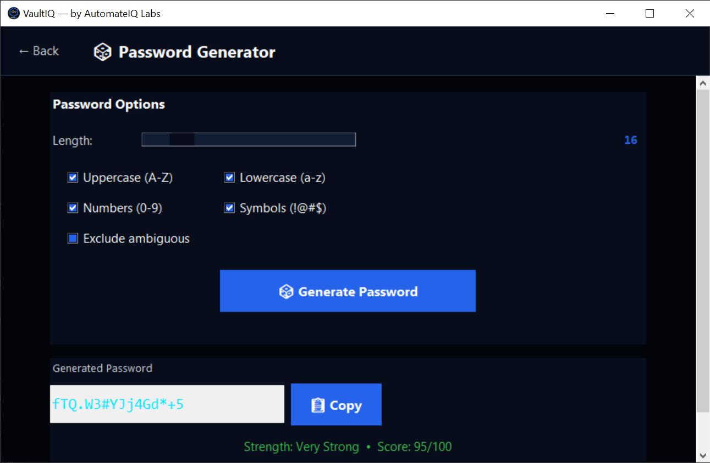

<div align="center">


<br/><br/>

```
██╗   ██╗ █████╗ ██╗   ██╗██╗  ████████╗██╗ ██████╗
██║   ██║██╔══██╗██║   ██║██║  ╚══██╔══╝██║██╔═══██╗
██║   ██║███████║██║   ██║██║     ██║   ██║██║   ██║
╚██╗ ██╔╝██╔══██║██║   ██║██║     ██║   ██║██║▄▄ ██║
 ╚████╔╝ ██║  ██║╚██████╔╝███████╗██║   ██║╚██████╔╝
  ╚═══╝  ╚═╝  ╚═╝ ╚═════╝ ╚══════╝╚═╝   ╚═╝ ╚══▀▀═╝
```

### *"Your passwords. Your device. Your control."*

**A military-grade, 100% offline desktop password manager — built for people who don't trust the cloud.**

<br/>

[-2563EB?style=for-the-badge&logoColor=white)](https://github.com/automateiq-labs/vaultiq/releases/latest/download/VaultIQ.exe)
&nbsp;&nbsp;
[](https://github.com/automateiq-labs/vaultiq/releases/latest/download/VaultIQ.exe)
&nbsp;&nbsp;
[](https://www.facebook.com/automateiq.labs)

</div>

---

## 📌 Table of Contents

- [Why VaultIQ?](#-why-vaultiq)
- [Features at a Glance](#-features-at-a-glance)
- [Security Architecture](#-security-architecture)
- [How to Download & Use](#-how-to-download--use)
- [Licensing & Pricing](#-licensing--pricing)
- [Screenshots & Demo](#-screenshots--demo)
- [Technical Stack](#-technical-stack)
- [System Requirements](#-system-requirements)
- [FAQ](#-faq)
- [About the Developer](#-about-the-developer)
- [Contact & Support](#-contact--support)

---

## ❓ Why VaultIQ?

Most people store their passwords in dangerous ways:

| ❌ Common Mistake | ⚠️ Risk |
|---|---|
| Written on paper | Lost, stolen, or damaged |
| Saved in browser | Vulnerable to hacking & malware |
| Same password everywhere | One breach = everything compromised |
| Cloud-based password managers | Your data lives on someone else's server |
| Remembered in head | Forgotten, or too simple to be secure |

**VaultIQ eliminates all of these risks.**

Your passwords are encrypted with **AES-256 military-grade encryption** and stored **only on your device** — no cloud, no internet, no risk. Think of it as a digital safe that lives entirely on your PC.

---

## ✨ Features at a Glance

### 🔐 Core Password Management
| Feature | Description |
|---|---|
| ➕ **Add Password** | Save site name, username, password & notes |
| 👁️ **Masked View** | Passwords hidden by default — reveal on demand |
| 📋 **One-Click Copy** | Copy username or password instantly |
| 🔍 **Instant Search** | Find any credential in milliseconds |
| ✏️ **Edit & Delete** | Full CRUD — manage credentials easily |
| 📝 **Secure Notes** | Attach notes to each entry (collapsible) |

### 🛡️ Security Features
| Feature | Description |
|---|---|
| 🔐 **Master Password** | bcrypt hashed — never stored in plain text |
| 🛡️ **AES-256-GCM Encryption** | The same standard used by militaries & banks |
| 🔒 **Hardware-Locked License** | One license key — works on ONE PC only |
| ⏱️ **Auto-Lock** | Vault locks automatically after 5 minutes of inactivity |
| 🚫 **Brute Force Protection** | 5 failed attempts → 10-minute lockout |
| 🔑 **Single Instance** | Only one app session allowed at a time |
| ☁️ **Zero Cloud Dependency** | 100% offline — data never leaves your device |

### 🔑 Built-in Password Generator
- Length: **8 to 64 characters**
- Toggle: Uppercase, Lowercase, Numbers, Symbols
- Option to **exclude ambiguous characters** (0, O, 1, l, I)
- Real-time **Strength Checker**: Very Weak → Very Strong

### 💾 Backup & Restore
| Feature | Description |
|---|---|
| 📤 **Manual Export** | Export encrypted backup to any folder or USB |
| 📥 **Manual Import** | Restore from backup with master password verification |
| 🔄 **Auto-Backup** | Automatic backup on every save, edit, or delete |
| 🔐 **Encrypted Backup** | Backup files are also AES-256 encrypted |

---

## 🔒 Security Architecture

VaultIQ uses **4 independent security layers**. All layers must pass before data is accessible.

```
┌──────────────────────────────────────────────────────────────┐
│                     VAULTIQ SECURITY LAYERS                  │
├──────────────────────────────────────────────────────────────┤
│                                                              │
│  LAYER 1 ─ Hardware-Locked License                           │
│  Machine ID = SHA-256(MachineGUID + CPU + MAC Address)       │
│  License   = HMAC-SHA256(MachineID, SecretKey)               │
│  → The same license key CANNOT work on a different PC        │
│                                                              │
│  LAYER 2 ─ Master Password (bcrypt)                          │
│  → bcrypt cost factor 12 = 2^12 iterations                   │
│  → Plain text password NEVER stored anywhere                 │
│  → Practically impossible to brute-force                     │
│                                                              │
│  LAYER 3 ─ AES-256-GCM Vault Encryption                      │
│  → PBKDF2HMAC key derivation: 600,000 iterations             │
│  → Random nonce on every single encryption                   │
│  → Data tampering is instantly detected                      │
│                                                              │
│  LAYER 4 ─ Compiled Binary (.exe)                            │
│  → Source code is hidden via PyInstaller                     │
│  → Significantly harder to reverse-engineer                  │
│                                                              │
└──────────────────────────────────────────────────────────────┘
```

### Encryption Specifications

| Parameter | Value |
|---|---|
| Algorithm | AES-256-GCM |
| Key Derivation | PBKDF2HMAC (SHA-256) |
| KDF Iterations | 600,000 |
| Key Size | 256-bit (32 bytes) |
| Salt | 128-bit random (per vault) |
| Nonce | 96-bit random (per encryption) |
| Password Hash | bcrypt (cost factor 12) |
| License HMAC | HMAC-SHA256 |
| Machine ID | SHA-256 |

> 💡 **In plain English:** Even if someone physically steals your hard drive, they cannot read your vault without your master password. The encryption is the same standard used by military intelligence and banking systems worldwide.

---

## 📥 How to Download & Use

### Step 1 — Download
Click the button below to download the `.exe` file directly:

**[⬇️ Download VaultIQ v1.0 — Windows (.exe)](https://github.com/automateiq-labs/vaultiq/releases/latest/download/VaultIQ.exe)**

> File size: ~60–80 MB | No installation required — just double-click and run.

### Step 2 — First Launch
```
1. Double-click VaultIQ.exe
2. Splash screen → Welcome screen appears
3. Click "Start 3-Day Free Trial"  (OR enter your License Key)
4. Set your Master Password (minimum 8 characters)
5. Your vault is ready — start adding passwords!
```

> ⚠️ **Remember your Master Password.** It is never stored anywhere. If you forget it, the vault cannot be recovered by anyone — including the developer.

### Step 3 — Add a Password
```
1. Click "+ Add Password"
2. Enter: Site Name (e.g., Facebook)
3. Enter: Username / Email
4. Enter your Password — or click "Generate" to create a strong one
5. Add Notes (optional)
6. Click "Save Password"
```

### Step 4 — Use a Saved Password
```
Dashboard → Find your site (search or scroll)
→ "CpPW"  → Copies password to clipboard (auto-clears in 30 seconds)
→ "CpID"  → Copies username to clipboard
→ "PW"    → Reveals/hides password
→ "ID"    → Reveals/hides username
```

### Moving to a New PC?
```
Option A (Recommended):
  Backup menu → "Choose Folder & Export"
  → Save to USB drive or Google Drive
  → On new PC: Welcome screen → "Import Existing Vault"
  → Enter master password → All data restored ✅

Option B:
  Copy your Desktop\VaultIQ\ folder to the new PC
```

> 🔑 Note: A new license key is required for a new PC. Contact via Facebook to get one.

---

## 💳 Licensing & Pricing

### Activation Options

| Mode | Duration | Cost | Features |
|---|---|---|---|
| 🆓 **Free Trial** | 3 days | ৳0 | Full access to all features |
| ✅ **Licensed** | Lifetime | ৳300–৳500 | Permanent, hardware-locked |
| 🏢 **Business** | Lifetime | ৳1,000+ | Custom branded version |

> All licenses are **one-time purchases** — no subscriptions, no renewals.

### How to Get a License Key

```
1. Download & run VaultIQ.exe
2. Your Machine ID will be displayed on the activation screen
3. Message us on Facebook with your Machine ID
4. Complete payment via bKash / Nagad / Bank Transfer
5. Receive your License Key — activate instantly
```

**[💬 Message on Facebook to Purchase →](https://www.facebook.com/automateiq.labs)**

---

## 🖥️ Screenshots

| Dashboard | Login Screen | Password Generator |
|:---:|:---:|:---:|
|  |  |  |

---

## 🛠️ Technical Stack

```
Language         Python 3.11+
UI Framework     Tkinter (built-in, no external GUI dependencies)
Encryption       cryptography library — AES-256-GCM, PBKDF2HMAC
Password Hashing bcrypt (cost factor 12)
Clipboard        pyperclip (auto-clear after 30 seconds)
Image Handling   Pillow (PIL)
Build Tool       PyInstaller (single .exe output)
Data Storage     JSON — AES-encrypted .vaultiq files
Config           JSON — .config files
```

### Project Size & Stats

| Metric | Value |
|---|---|
| Total Python Files | 9 source files |
| Total Lines of Code | 5,300+ lines |
| UI Code (ui.py) | 2,100+ lines |
| Security Layers | 4 independent layers |
| Unique Screens | 9 screens |
| Total Features | 25+ features |
| Build Output Size | ~60–80 MB (.exe) |

### File Architecture

| File | Lines | Role |
|---|---|---|
| `ui.py` | 2,100+ | Complete UI — all 9 screens |
| `admin_tool.py` | 950+ | License generator & customer records |
| `vault.py` | 560+ | Credential storage engine |
| `encryption.py` | 260+ | AES-256-GCM engine |
| `auth.py` | 390+ | Authentication & session management |
| `license.py` | 510+ | Hardware lock & trial system |
| `generator.py` | 440+ | Password generator & strength checker |
| `backup.py` | 420+ | Backup & restore system |
| `main.py` | 222 | Entry point & environment checks |

---

## 💻 System Requirements

| Requirement | Minimum |
|---|---|
| **Operating System** | Windows 7 / 10 / 11 (64-bit recommended) |
| **RAM** | 50 MB |
| **Storage** | 20 MB (app) + vault data |
| **Internet** | ❌ Not required — fully offline |
| **Installation** | ❌ Not required — portable .exe |
| **Admin Rights** | Not required for standard use |

> VaultIQ is fully self-contained. No Python installation, no runtime, no dependencies — just run the `.exe`.

---

## ❓ FAQ

**Q: Does VaultIQ send any data to the internet?**
> No. VaultIQ is 100% offline. It has zero network calls, zero telemetry, and zero cloud sync. Your data never leaves your PC.

**Q: What happens if I forget my master password?**
> The master password is never stored — not even by the developer. If you forget it, the vault cannot be recovered. Always keep a secure note of your master password.

**Q: Can I use the same license on multiple PCs?**
> No. Each license key is cryptographically bound to one specific PC using hardware fingerprinting. A new license is required for each device.

**Q: Is the free trial limited in any way?**
> No. The 3-day free trial gives full access to every feature. It simply expires after 72 hours.

**Q: Can I back up my vault and use it on a new PC?**
> Yes. Export your encrypted backup, install VaultIQ on the new PC, purchase a new license, then import your backup with your master password.

**Q: What if the developer stops support?**
> Since VaultIQ is fully offline and your license is verified locally, the app will continue to work indefinitely — no server dependency whatsoever.

**Q: Is VaultIQ open source?**
> The source code is proprietary and not publicly distributed. This repository is used for distribution and documentation only.

---

## 👨‍💻 About the Developer

<div align="center">

**AutomateIQ Labs**

*Building intelligent software solutions for the modern world.*

Python Developer · Cybersecurity Enthusiast · Desktop App Builder · AI Automation Expert

</div>

VaultIQ is built and maintained by **AutomateIQ Labs** — a software development brand focused on building practical, secure, and user-first applications. This project demonstrates real-world implementation of:

- 🔐 Applied cryptography (AES-256-GCM, PBKDF2, bcrypt)
- 🖥️ Production-grade desktop application development
- 🔑 Custom hardware-locked software licensing systems
- 🏗️ Clean multi-module Python architecture
- 📦 Professional software packaging & distribution

---

## 📞 Contact & Support

<div align="center">

| Platform | Link |
|---|---|
| 💬 **Facebook Page** | [facebook.com/automateiq.labs](https://www.facebook.com/automateiq.labs) |
| 💼 **LinkedIn** | [linkedin.com/in/YOUR-LINKEDIN-HERE](https://www.linkedin.com/in/muhammad-antor) |
| 📧 **License Inquiries** | Message via Facebook Page |
| 🐛 **Bug Reports** | Open a GitHub Issue |

</div>

**For license purchases:**
1. Message the Facebook page with your Machine ID
2. Complete payment (bKash / Nagad / Bank Transfer)
3. Receive your License Key within minutes

---

## ⚖️ Legal

```
VaultIQ is proprietary software. © 2026 AutomateIQ Labs. All rights reserved.

✅ Permitted:
   → Personal use with a valid license key
   → Backup and restore on the licensed PC
   → Transfer to a new PC (new license required)

❌ Not Permitted:
   → Copying, distributing, or sharing without permission
   → Reverse engineering or decompiling
   → Reselling or sublicensing
   → Using any part of the source code without permission
```

---

<div align="center">

**Keywords:** password manager offline windows, free password manager windows, secure password manager no cloud, AES-256 password manager, offline password vault, vaultiq password manager, automateiq labs, python password manager, local password manager, encrypted password storage, password manager bangladesh, hardware locked software license, best offline password manager 2026, no internet password manager, free trial password manager

---


*VaultIQ v1.0 — © 2026 AutomateIQ Labs*

*"Your passwords. Your device. Your control."*

</div>
